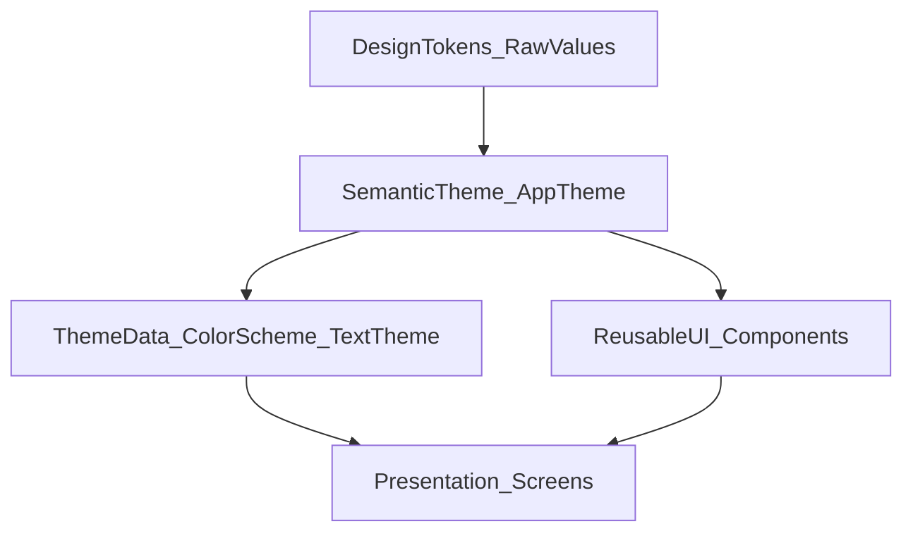

# UI Design System Migration Plan (Theme-first, incremental)

## Architecture (target)

- **Design tokens (raw values)**: numbers/hex only (no meaning).
- **Semantic theme layer**: meaning-based API (title/body, surface/error, spacing roles). Owns mapping from tokens → meaning.
- **ThemeData integration**: Material defaults (AppBar, TextButton, InputDecoration, Dialog, BottomSheet, SnackBar, etc.) read from semantics.
- **Optional custom components**: encapsulate repeated patterns (cards, section headers, form rows) using semantic layer.
- **Rule**: screens/widgets must not call raw tokens; they should consume **ThemeData / semantic extensions / components**.

## UI audit (analysis only)

### What we already see in this repo

- **There is an existing tokens file**: `lib/core/constants/design_tokens.dart` already contains Colors/Spacing/Radius/Elevation/Icons and some TextStyles.
- **Hardcoded UI still exists heavily** (26 files under `lib/presentation/views/**` have many occurrences of `TextStyle(`, `Colors.*`, `EdgeInsets.*`, `BorderRadius.circular`, `BoxShadow`, icon sizes, etc.).
- **Highest hotspots** (by quick scan counts):
  - `lib/presentation/views/class/teacher/create_class_screen.dart` (~210 hardcoded-pattern matches)
  - `lib/presentation/views/class/teacher/edit_class_screen.dart` (~165)
  - `lib/presentation/views/class/teacher/add_student_by_code_screen.dart` (~59)

### Repeated visual patterns worth standardizing

- **Section header label**: e.g. “THÔNG TIN CHUNG”, “QUẢN LÝ THAM GIA” uses a repeated small bold + letterSpacing + grey.
- **Card container**: `Container(padding: 20, color: white, radius: 12, border grey, shadow black alpha…)` repeats in create/edit.
- **Form field rows**: icon-in-badge + label + required asterisk + InputDecoration (hintStyle/border/fillColor) repeats.
- **Chip/badge styles**: pill radius + small text + background color (counts/badges) repeats.
- **Button variants**: primary/outline/ destructive with repeated paddings/radius.

### Risk categorization (why)

- **Low risk** (safe early wins):
  - Small screens with limited custom styling; mostly Text + Icon + button where we can rely on ThemeData.
  - Examples: `lib/presentation/views/auth/login_screen.dart`, `lib/presentation/views/network/no_internet_screen.dart`.
  - Why: fewer layout dependencies; easy visual verification.
- **Medium risk**:
  - Screens using tokens but still override a few colors/text styles locally; some custom containers.
  - Why: changes may affect spacing/alignment but still manageable.
- **High risk**:
  - Large, complex, multi-section forms with many custom decorations and repeated local styles.
  - Examples: `lib/presentation/views/class/teacher/create_class_screen.dart`, `lib/presentation/views/class/teacher/edit_class_screen.dart`.
  - Why: lots of micro-styles; refactor can cause subtle regressions (padding, border, text baseline, focus states).

## Step 1 — Token system redesign (frontend-style, critical)

### Target token folder structure (raw values only)

- `lib/core/design_system/tokens/`
  - `color_palette_tokens.dart`
  - `typography_scale_tokens.dart`
  - `spacing_scale_tokens.dart`
  - `radius_scale_tokens.dart`
  - `elevation_tokens.dart`
  - `opacity_tokens.dart`
  - `icon_size_tokens.dart`

### Token file responsibilities + naming rules

#### `color_palette_tokens.dart`

- Owns: raw color values only (brand, neutrals, accent palettes, support palettes).
- Values: hex ARGB/RGB constants (raw).
- Naming rules (scale/palette-based, no meaning):
  - GOOD: `brand_blue_500`, `brand_blue_600`, `neutral_050`, `neutral_900`, `accent_teal_500`
  - BAD: `primary_button_bg`, `error_text`, `app_bar_background`

#### `typography_scale_tokens.dart`

- Owns: raw typography scales and primitives (font sizes, line heights, letter spacings, font weights).
- Values: `double` for size/lineHeight/letterSpacing; `FontWeight` for weights.
- Naming rules (scale-based, no meaning):
  - GOOD: `font_size_10`, `font_size_12`, `font_size_14`; `line_height_tight`, `line_height_normal`, `line_height_loose`; `font_weight_regular`, `font_weight_medium`, `font_weight_bold`
  - BAD: `page_title_font`, `section_header_font` (semantic); `error_message_text_style` (TextStyle belongs higher)

#### `spacing_scale_tokens.dart`

- Owns: raw spacing scale (dp).
- Values: `double` (dp).
- Naming rules (scale-based):
  - GOOD: `space_2`, `space_4`, `space_8`, `space_12`, `space_16`, `space_24` (or `space_xs/sm/md/lg/xl` if documented as numeric scale)
  - BAD: `card_padding`, `screen_margin`, `button_horizontal_padding` (semantic purpose)

#### `radius_scale_tokens.dart`

- Owns: raw corner radii.
- Values: `double`.
- Naming rules (scale-based):
  - GOOD: `radius_0`, `radius_4`, `radius_8`, `radius_12`, `radius_16`, `radius_full`
  - BAD: `card_radius`, `input_radius`, `button_radius` (semantic shape roles)

#### `elevation_tokens.dart`

- Owns: raw shadow/elevation primitives (blur, offset, alpha) grouped by level.
- Values: numeric primitives; optionally grouped into immutable configs by level.
- Naming rules (level-based):
  - GOOD: `elevation_level_0`, `elevation_level_1`, `elevation_level_2`
  - BAD: `dialog_shadow`, `fab_shadow`, `bottom_nav_shadow` (semantic usage)

#### `opacity_tokens.dart`

- Owns: reusable opacity levels (alpha).
- Values: `double` (0–1) or integer percent scale (0–100), but keep consistent.
- Naming rules (level-based):
  - GOOD: `opacity_04`, `opacity_08`, `opacity_12`, `opacity_16`
  - BAD: `disabled_opacity`, `hover_opacity` (semantic states)

#### `icon_size_tokens.dart`

- Owns: raw icon sizes in dp.
- Values: `double`.
- Naming rules (scale-based):
  - GOOD: `icon_size_16`, `icon_size_20`, `icon_size_24`, `icon_size_32`
  - BAD: `toolbar_icon_size`, `button_icon_size` (semantic; belongs to semantic layer)

### Legacy `design_tokens.dart` strategy (no breakage, no big-bang)

Current legacy file is a mix of:

- Tokens (good): raw colors/spacings/radii.
- Semantics (bad): “primary”, “success”, “drawerIcon”, etc. living in token layer.
- TextStyles (wrong layer): `DesignTypography.*` contains `TextStyle` values.

Strategy:

- Step 1 — Freeze: mark legacy as legacy; **no new constants** added.
- Step 2 — Extract: create new `tokens/*` files; copy raw values into palette/scale tokens.
- Step 3 — Semantic pivot: semantic layer depends on new tokens (not legacy). Legacy UI can keep using `DesignColors/DesignTypography` until migrated.
- Step 4 — Deprecate & enforce: new UI must not import legacy; must use Theme/ThemeExtension/DS components. Over time legacy becomes a thin compatibility shim or is removed.

## Step 2 — Semantic layer design (source of truth)

### Folder structure (new + refactor targets)

- `lib/core/design_system/tokens/` (raw-only, frontend-style)
  - `color_palette_tokens.dart`
  - `typography_scale_tokens.dart`
  - `spacing_scale_tokens.dart`
  - `radius_scale_tokens.dart`
  - `elevation_tokens.dart`
  - `opacity_tokens.dart`
  - `icon_size_tokens.dart`
- `lib/core/design_system/semantics/`
  - `app_colors.dart` (semantic roles: primary/surface/onSurface/error/onError/outline…)
  - `app_text_styles.dart` (semantic: pageTitle/sectionTitle/body/caption/label/button)
  - `app_spacing.dart` (semantic: screenPadding/sectionGap/itemGap/inlineGap)
  - `app_shapes.dart` (card/input/button radius)
  - `app_theme.dart` (single object exposing semantics; built from tokens)
  - `theme_extensions.dart` (ThemeExtension for `AppTheme` access)
- `lib/core/design_system/material/`
  - `theme_data_factory.dart` (build ThemeData from semantic layer)
  - `component_themes.dart` (InputDecorationTheme, AppBarTheme, DialogTheme, BottomSheetTheme, SnackBarTheme, Button themes)
- `lib/widgets/design_system/` (optional, incremental)
  - `app_card.dart`, `app_section_header.dart`, `app_form_field_row.dart`, `app_badge.dart`

### Responsibilities & dependency rules

- **Tokens**
  - Own: raw numeric/color constants only.
  - Must NEVER: expose “meaning” names (e.g. `primaryButtonBg`).
  - Depend on: nothing.
- **Semantic layer (`AppTheme`)**
  - Own: meaning-based names + mapping from tokens to meaning.
  - Must NEVER: import UI screens; must not know features.
  - Depend on: tokens only.
- **Material ThemeData layer**
  - Own: configuring Material defaults from semantic layer.
  - Must NEVER: contain raw token values directly.
  - Depend on: semantic layer.
- **Components**
  - Own: repeated visual patterns that screens use.
  - Must NEVER: bypass semantic theme to call tokens.
  - Depend on: semantic layer + ThemeData.
- **Screens**
  - Own: layout + business UI logic only.
  - Must NEVER: use raw tokens; should use `Theme.of(context)` and/or semantic extension (`context.appTheme`) and/or components.

### Legacy `design_tokens.dart` handling (freeze + sunset)

- **Freeze rule (immediate)**: `lib/core/constants/design_tokens.dart` is legacy. Do not add new tokens/semantics/styles there.
- **Migration approach (no breakage)**: keep legacy usage for existing UI, but all new DS work must source from `lib/core/design_system/tokens/**` → `semantics/**` → `material/**`.
- **Sunset condition (removal criteria)**: `design_tokens.dart` may be removed only when:
  - No imports remain in `lib/presentation/**`
  - All semantic mappings are sourced from the new token set (not legacy)
  - CI/grep confirms zero usage across the repo
  - (Optional) A release has shipped with the new DS as default to avoid last-minute regressions

### Semantic strategy (naming)

### Text semantics (purpose, not size)

- Good:
  - `pageTitle`, `sectionTitle`, `fieldLabel`, `body`, `caption`, `buttonLabel`, `badgeLabel`
- Bad:
  - `text18Bold`, `h1_22`, `bigTitle`, `smallGreyText`

### Color semantics (role, not hex)

- Good:
  - `primary`, `onPrimary`, `surface`, `onSurface`, `surfaceVariant`, `outline`, `error`, `onError`, `success`, `warning`, `info`
- Bad:
  - `blue500`, `grey200`, `primaryBlue`, `dangerRed600` (these are tokens/palette naming)

### Semantic size control rule (prevent semantic explosion)

- **Rule**: Semantic roles MUST map to the closest Material role (TextTheme/ColorScheme) rather than introducing new semantics for every visual variation.
  - Goal: keep Material `TextTheme` as the backbone; avoid team creating `sectionTitleLarge`, `sectionTitleMuted`, etc.

### Support colors guideline (success/warning/info)

- **Guideline**: Only introduce `success`/`warning`/`info` semantics (usually via ThemeExtension) if the app has real UX flows that require them (forms, validation, system feedback).
  - Goal: prevent semantic layer from growing too early without clear product needs.

### Spacing semantics (purpose, not dp)

- Good:
  - `screenPadding`, `sectionGap`, `itemGap`, `inlineGap`, `cardPadding`, `fieldGap`
- Bad:
  - `p16`, `gap24`, `spacingXXL` (size-based)

### Semantic responsibility table (source of truth boundaries)

| Layer | Owns | MUST NOT | Allowed dependencies | Who is allowed to import it |

|---|---|---|---|---|

| Tokens (`tokens/*`) | raw values only (hex, numbers, weights) | semantics like `primary`, `error`; any UI styling objects | none | semantic layer only |

| Semantic (`AppTheme`) | meaning-based API (pageTitle/surface/sectionGap) + mapping tokens→meaning | feature-specific decisions; direct widget layout; raw hardcoded constants not in tokens | tokens only | ThemeData factory + DS components |

| Material (`ThemeData`) | Material defaults (ColorScheme/TextTheme/component themes) | raw tokens directly; feature logic | semantic layer | app root + DS components + screens (via Theme.of) |

| DS components | pattern UI building blocks | feature state/business logic; direct tokens | ThemeData + semantic extensions | screens |

| Screens | feature UI & state wiring | tokens import; new local styling variants | Theme.of + DS components | n/a |

## Step 4 — Migration plan (incremental, safe)

### Phase 1 — Introduce design system without using it

- Change:
  - Add new folder structure and create `AppTheme` (semantic) + ThemeExtension + ThemeData factory.
  - Keep existing UI unchanged.
- Don’t touch:
  - Any screen layout.
- Verify:
  - App compiles; Theme can be instantiated; no visual change expected.

### Phase 2 — ThemeData integration (global defaults)

- Change:
  - Wire ThemeData in `lib/main.dart`.
  - Configure `ColorScheme`, `TextTheme`, `InputDecorationTheme`, button themes, AppBarTheme, Dialog/BottomSheet/SnackBar.
- Don’t touch:
  - Complex screens (create/edit forms).
- Verify:
  - Smoke test: login/register/no-internet/splash; confirm defaults apply where styles weren’t overridden.

### Phase 3 — Migrate low-risk widgets/screens

- Change:
  - Replace local `TextStyle(...)`, `Colors.*`, `EdgeInsets(...)` in low-risk screens with `Theme.of(context)` + semantic helpers.
  - Introduce 1–2 small components if repetition is obvious (e.g., `AppSectionHeader`).
- Don’t touch:
  - High-risk forms.
- Verify:
  - Golden screenshots (manual) + regression checklist per screen.

### Phase 4 — Migrate complex screens (high risk)

- Change:
  - Extract repeated patterns into components first (card container, form row, badges).
  - Convert screen to use those components + semantic theme.
  - Keep behavior unchanged; only styling.
- Don’t touch:
  - Data/state logic.
- Verify:
  - Side-by-side visual diff (before/after), focus states, error states, keyboard interactions.

### Phase 5 — Cleanup & enforcement

- Change:
  - Deprecate direct usage of `DesignColors/DesignTypography/DesignSpacing` in presentation.
  - Add CI checks and code review checklist.
- Don’t touch:
  - Legacy UI outside `lib/presentation/**` until the rule is stable.
- Verify:
  - Automated grep-based gate + review checklist compliance.

## Step 5 — Enforcement & governance (prevent regression)

### DO / DO NOT

- DO:
  - Use `Theme.of(context).colorScheme` and `Theme.of(context).textTheme`.
  - Use `ThemeExtension` (e.g., `context.appTheme`) for semantic roles not covered by Material.
  - Create small components for repeated patterns.
- DO NOT (in `lib/presentation/**`):
  - `Color(0x...)`, `Colors.*` (except rare allowed list like `Colors.transparent`)
  - `TextStyle(...)` inline
  - `EdgeInsets.*` with raw numbers
  - `BorderRadius.circular(12)` with raw numbers
  - `Icon(size: 16)` with raw numbers

### Exception (escape hatch for deadlines)

- A screen may temporarily violate the rules ONLY IF:
  - It is marked with `TODO(design-system-migration)`
  - The violation is localized (small scope) and documented (why + intended follow-up)
  - No new pattern duplication is introduced (prefer reusing existing DS patterns even if the screen isn’t fully migrated yet)

## Step 3 — ThemeData & Material strategy (Theme-first rules)

### Theme wiring principles

- **UI widgets must prefer** `Theme.of(context)` (`colorScheme`, `textTheme`, and component themes).
- **Direct use of semantic classes** is restricted to:
  - Theme configuration (ThemeData factory)
  - Design-system components (pattern widgets)
- **Tokens are never imported by UI**, only by semantic layer.

### What goes into ThemeData vs ThemeExtension

- **ThemeData / Material themes (default path)**:
  - `ColorScheme` (primary/surface/background/error/outline/on* roles)
  - `TextTheme` (map semantics to closest Material roles)
  - `AppBarTheme`
  - `InputDecorationTheme`
  - Button themes (Elevated/Outlined/Text)
  - `DialogTheme`
  - `BottomSheetThemeData`
  - `SnackBarThemeData`
- **ThemeExtension (only when Material does not cover it cleanly)**:
  - Spacing semantics (screenPadding/sectionGap/itemGap/inlineGap)
  - Shape presets beyond Material defaults (cardRadius/inputRadius/buttonRadius if needed as semantic bundle)
  - Pattern configs (CardStyles, ChipStyles, BadgeStyles)
  - Support colors (`success/warning/info`) only if justified by real UX flows

### Semantic Text → TextTheme → UI usage (rule of thumb)

- Semantic roles map to the closest Material role (do not invent new semantics for every visual tweak).
- UI reads text styles from `Theme.of(context).textTheme.*` or uses DS components that do the same.

## Step 4 — Responsive & accessibility readiness (rules)

- **Tokens MUST remain static** (no device logic inside tokens).
- **Semantic layer is the only place allowed to adapt** based on:
  - Screen size (phone/tablet/desktop)
  - Accessibility (text scale)
  - Platform differences (Android/iOS)
- ThemeData should remain a pure projection of the semantic layer at a given runtime context.

### Tooling suggestions

- **Pre-commit/CI**: grep gate for forbidden patterns in `lib/presentation/**`.
- **Code review checklist**: ensure new UI uses Theme/semantic/components only.
- Optional: adopt a lint package if the repo already supports it; otherwise keep grep-gate initially (lowest risk).

## Risks & mitigations

- **Risk: subtle visual regression** (spacing, typography, borders)
  - Mitigation: migrate screen-by-screen; keep diffs small; add manual visual checklist per screen.
- **Risk: over-abstracting semantics**
  - Mitigation: start with minimal semantic set (pageTitle/sectionTitle/body, primary/surface/error, screenPadding/sectionGap/itemGap) then expand.
- **Risk: conflict with existing `design_tokens.dart` usage**
  - Mitigation: treat `design_tokens.dart` as legacy tokens; introduce semantic layer above it; later split tokens out.
- **Risk: Material defaults change UI unexpectedly**
  - Mitigation: enable ThemeData integration first but migrate low-risk screens next; keep overrides until migrated.

---

# Execution TODOs (100% aligned with plan)

> Purpose: a step-by-step checklist that a junior developer can follow safely. Each TODO has a Definition of Done (DoD) and verification strategy.

## Step 0 — UI audit (baseline, before touching UI)

### TODO 0.1 — Create a baseline audit report (read-only)

- Inventory: list files under `lib/presentation/**` that contain hardcoded UI patterns.
- For each file, tag it as Low/Medium/High risk (with 1–2 sentences why).
- Extract top repeated patterns:
  - Section header
  - Card container
  - Form field row
  - Badge/chip
  - Primary/secondary/destructive buttons
- DoD:
  - A short list of “Top 5–10 patterns” exists.
  - A short “Top 5 risky screens” list exists.
- Verify:
  - Quick grep counts (TextStyle/Colors/EdgeInsets/BorderRadius/BoxShadow/Icon size).

## Step 1 — Token system redesign (raw values only)

### TODO 1.1 — Define token naming conventions (team agreement)

- Decide scale conventions:
  - Colors: palette+scale (`brand_blue_500`, `neutral_050`)
  - Spacing: numeric scale (`space_4`, `space_8`, …)
  - Radius: numeric scale (`radius_12`, `radius_full`)
  - Typography primitives: `font_size_*`, `font_weight_*`, `line_height_*`, `letter_spacing_*`
  - Opacity: `opacity_04` etc.
  - Elevation: `elevation_level_1` etc.
- DoD:
  - A “GOOD vs BAD naming” doc section exists in this plan.
- Verify:
  - Names contain no semantics like `primary`, `error`, `button`, `title`.

### TODO 1.2 — Freeze legacy `design_tokens.dart`

- Add/confirm “legacy” header comment and freeze rule.
- DoD:
  - Everyone agrees: no new constants added to legacy file.
- Verify:
  - PR checklist includes “did you add to legacy design_tokens.dart?” (must be no).

### TODO 1.3 — Extract raw values into new token files (non-breaking)

- Create token files in `lib/core/design_system/tokens/*`.
- Copy raw numeric/hex values from legacy into tokens.
- DoD:
  - Token files exist and compile.
  - No UI code is changed to use them yet.
- Verify:
  - App builds with zero UI diff expectation.

## Step 2 — Semantic layer design (source of truth)

### TODO 2.1 — Define minimal semantic set (v1)

- Text semantics v1:
  - `pageTitle`, `sectionTitle`, `body`, `bodyMuted`, `caption`, `buttonLabel`
- Color semantics v1:
  - `primary`, `onPrimary`, `surface`, `onSurface`, `background`, `onBackground`, `outline`, `error`, `onError`
  - `success/warning/info`: only if real UX flows require (else defer)
- Spacing semantics v1:
  - `screenPadding`, `sectionGap`, `itemGap`, `inlineGap`, `cardPadding`
- Shapes v1:
  - `cardRadius`, `inputRadius`, `buttonRadius`, `sheetRadius`
- DoD:
  - Semantic API list is frozen for v1.
- Verify:
  - No semantics like `sectionTitleLarge`, `sectionTitleMuted` are introduced.

### TODO 2.2 — Define semantic-to-token mapping tables (no code yet)

- Create mapping tables in the plan for:
  - `pageTitle → closest TextTheme role` (e.g., `headlineMedium`)
  - `sectionTitle → closest TextTheme role` (e.g., `titleMedium`)
  - `primary/surface/error/outline → closest ColorScheme role`
  - spacing/shape mappings
- Enforce rule:
  - “Semantic roles MUST map to closest Material roles.”
- DoD:
  - Mapping tables exist and are reviewed.
- Verify:
  - Each semantic has a single canonical Material target.

### TODO 2.3 — Decide ThemeExtension boundaries (v1)

- Decide what must be ThemeExtension vs pure Material:
  - ThemeExtension: spacing bundle, card/chip/badge configs, support colors (if needed)
  - Material: ColorScheme/TextTheme + component themes
- DoD:
  - A boundary list exists (what goes where).
- Verify:
  - Screens will not need to import semantic classes directly.

## Step 3 — ThemeData & Material strategy

### TODO 3.1 — Define ThemeData scope (v1)

- Decide which Material themes will be configured in v1:
  - `ColorScheme`, `TextTheme`, `AppBarTheme`, `InputDecorationTheme`, button themes, `DialogTheme`, `BottomSheetThemeData`, `SnackBarThemeData`
- DoD:
  - A “ThemeData configuration checklist” exists.
- Verify:
  - No raw tokens are referenced directly in ThemeData; only semantic layer outputs.

### TODO 3.2 — Define usage rules for UI vs DS components

- Rules:
  - Screens: use `Theme.of(context)` + DS components.
  - DS components: allowed to read ThemeExtension + ThemeData.
  - Tokens: never imported by screens.
- Add escape hatch rule:
  - `TODO(design-system-migration)` allowed with localized/documented violations.
- DoD:
  - Rules are written and added to PR checklist.
- Verify:
  - Reviewers can reliably enforce.

## Step 4 — Responsive & accessibility readiness

### TODO 4.1 — Define adaptation policy (v1, no code yet)

- State explicitly:
  - Tokens are static.
  - Semantic layer is the only adaptation point.
- Define triggers:
  - Breakpoints (phone/tablet/desktop)
  - text scale thresholds
  - platform adjustments
- DoD:
  - A one-page policy exists.
- Verify:
  - No screen-level `MediaQuery` style tweaking for typography/spacing.

## Step 5 — Migration plan (incremental)

### TODO 5.1 — Phase 1 (Introduce DS structure unused)

- Allowed:
  - Add new token + semantic + ThemeData scaffolding.
- Forbidden:
  - No refactors in `lib/presentation/**`.
- DoD:
  - Project builds; no intended visual changes.
- Verify:
  - Smoke run; no regressions.

### TODO 5.2 — Phase 2 (ThemeData integration only)

- Allowed:
  - Wire ThemeData in app root.
- Forbidden:
  - No complex screen refactors.
- DoD:
  - Material defaults consistent on low-risk screens.
- Verify:
  - Manual smoke test: splash/login/register/no-internet.

### TODO 5.3 — Phase 3 (Migrate low-risk patterns)

- Migrate by pattern first:
  - SectionHeader
  - Basic Card
  - Button styles
- DoD:
  - 2–3 low-risk screens no longer contain inline `TextStyle/Colors/EdgeInsets`.
- Verify:
  - Grep-based comparison before/after for those screens.

### TODO 5.4 — Phase 4 (Migrate complex screens via pattern extraction)

- Extract patterns:
  - Card container
  - Form field row
  - Chips/badges
- DoD:
  - Complex screens use DS components for repeated chunks.
- Verify:
  - Visual before/after + focus/error/keyboard states.

### TODO 5.5 — Phase 5 (Cleanup)

- Deprecate legacy usage paths.
- DoD:
  - No new legacy imports in `lib/presentation/**`.
- Verify:
  - CI warns/blocks new violations.

## Step 6 — Enforcement & governance

### TODO 6.1 — Define forbidden patterns list + allowlist

- Forbidden (target): `Color(0x)`, `Colors.*`, `TextStyle(`, raw `EdgeInsets`, raw `BorderRadius`, raw `BoxShadow`, raw `Icon(size: ...)`.
- Allowlist (minimal): `Colors.transparent` only if necessary.
- DoD:
  - Documented policy + examples.
- Verify:
  - Reviewers apply consistently.

### TODO 6.2 — Add enforcement stages by phase

- Phase 1–2: guidance only.
- Phase 3–4: non-blocking warnings.
- Phase 5+: blocking CI.
- DoD:
  - Enforcement timeline is explicit.
- Verify:
  - CI behavior matches phase.

### TODO 6.3 — Sunset `design_tokens.dart`

- Preconditions:
  - No imports in `lib/presentation/**`
  - Semantics sourced from new tokens
  - CI/grep zero usage
  - Ship at least 1 release with new DS default
- DoD:
  - File removed or reduced to empty shim.
- Verif
  - Grep confirms no references.