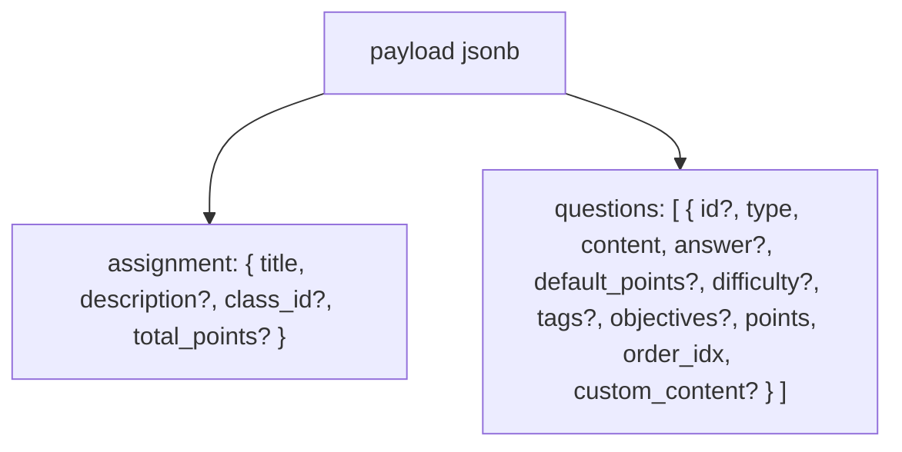

## Kế hoạch chỉnh sửa luồng lưu bài tập + RPC transactional

### 1. Chuẩn hóa lại luồng dữ liệu theo thiết kế Question Bank

- **Rà soát hiện trạng**
  - Đọc luồng hiện tại trong `lib/presentation/views/assignment/teacher/teacher_create_assignment_screen.dart` và `teacher_create_question_screen.dart` để xem app đang:
    - Tạo câu hỏi (bank) ở đâu, khi nào.
    - Tạo `assignments` và `assignment_questions` ra sao (lần lượt hay gộp).
    - Có đang set `due_at`/`available_from` trực tiếp trong `assignments` hay không.
  - Kiểm tra `AssignmentRepository` và `QuestionRepository` trong domain/data layer để nắm các hàm đang gọi Supabase (đặc biệt create/update assignment, create/update question, publish RPC hiện tại).

- **Định nghĩa luồng chuẩn (Giai đoạn 1 – Template)**
  - Áp dụng đúng thứ tự bạn yêu cầu:

    1. **Bước 1 – Tạo câu hỏi gốc**: Insert vào `questions` (content/answer là JSONB phẳng với key cố định: `text`, `images`, `latex`...), nếu câu hỏi là mới.
    2. **Bước 2 – Chi tiết câu hỏi**: Nếu là trắc nghiệm, insert vào `question_choices`; insert `question_objectives` cho các LO đã chọn.
    3. **Bước 3 – Tạo bài tập (template)**: Insert vào `assignments` với `is_published = false`, *không lưu* `due_at`/`available_from` ở đây.
    4. **Bước 4 – Tạo liên kết**: Insert vào `assignment_questions` với `assignment_id` + `question_id` hoặc `custom_content` nếu override.

  - Đảm bảo quy tắc:
    - Một assignment **chỉ được coi là hợp lệ** nếu có ≥ 1 bản ghi trong `assignment_questions`.
    - Khi render/ chấm điểm: luôn ưu tiên `custom_content` nếu không NULL, nếu NULL mới fallback sang `questions.content`.
    - `total_points` trong `assignments` phải bằng tổng `points` các dòng trong `assignment_questions`.

- **Điều chỉnh app để tuân thủ luồng**
  - Ở màn tạo câu hỏi:
    - Giữ đúng pattern: khi lưu, luôn **ghi question bank trước** (`questions`, `question_choices`, `question_objectives`).
    - Không ghi trực tiếp vào `assignment_questions` ở màn này.
  - Ở màn tạo bài tập:
    - Khi thêm câu hỏi từ bank: chỉ chọn `question_id` + cấu hình `points`, `order_idx`, metadata.
    - Khi thêm câu hỏi custom: tạo object local dạng JSON phẳng theo chuẩn, để gửi lên `custom_content` (không ghi vào `questions`).
    - Không ghi `due_at`/`available_from` vào `assignments` nữa (chỉ dùng bên `assignment_distributions` trong giai đoạn publish).

### 2. Thiết kế RPC `create_assignment_with_questions` (transactional)

- **Chữ ký hàm & payload JSON**
  - Tạo function trong Postgres (schema `public`) với chữ ký kiểu:
    - `create_assignment_with_questions(p_teacher_id uuid, p_payload jsonb) returns uuid` (trả về `assignment_id`).
  - Chuẩn JSON theo lựa chọn của bạn:


- **Logic trong function (PL/pgSQL)**
  - Bọc toàn bộ trong `BEGIN ... EXCEPTION ...` (mặc định function là transactional, nhưng ta sẽ xử lý EXCEPTION rõ ràng và raise error mô tả).
  - **Bước 1: Parse `assignment` từ `p_payload -> 'assignment'`**
    - Insert vào `public.assignments`:
      - `teacher_id = p_teacher_id`
      - `title`, `description`, `class_id`
      - `is_published = false`
      - `total_points` tạm thời `NULL` hoặc giá trị gửi kèm (sẽ validate lại sau).
    - Lưu `v_assignment_id` (uuid) từ `RETURNING id`.

  - **Bước 2: Lặp mảng `questions` (`p_payload -> 'questions'`)**
    - Với mỗi phần tử `q` trong `jsonb_array_elements(p_payload->'questions')`:
      - Nếu `q->>'id'` **không NULL**:
        - Đây là câu hỏi đã có trong bank → chỉ dùng `question_id = (q->>'id')::uuid`, **không insert lại** `questions`.
        - Có thể tùy chọn validate: kiểm tra câu hỏi đó thuộc về `p_teacher_id` hoặc là `is_public = true`.
      - Nếu không có `id`:
        - Đây là câu hỏi mới → insert vào `public.questions` với:
          - `author_id = p_teacher_id`
          - `type = q->>'type'`
          - `content = q->'content'`
          - `answer = q->'answer'`
          - `default_points = coalesce((q->>'default_points')::numeric, 1)`
          - `difficulty = (q->>'difficulty')::int` (nếu có)
          - `tags = string_to_array(coalesce(q->>'tags_csv',''), ',')` hoặc cast mảng JSON nếu truyền dạng array.
        - `RETURNING id` vào `v_question_id`.
        - Nếu `q` có `objectives` (mảng uuid/strings):
          - Lặp qua mảng, insert vào `question_objectives(question_id, objective_id)`.
        - Nếu `q->>'type' = 'multiple_choice'` và trong `q` có mảng `choices`:
          - `jsonb_array_elements(q->'choices')` → insert vào `question_choices`:
            - `id` = index (0,1,2,...),
            - `question_id = v_question_id`,
            - `content` = object JSON {text, image_url?},
            - `is_correct` = (choice->>'is_correct')::boolean.

      - Gán `v_question_id` cuối cùng là:
        - Id sẵn có (reuse) hoặc id mới insert (new).

      - **Quy tắc custom_content (override)**
        - Lấy `v_base_content`:
          - Nếu có `v_question_id` (câu hỏi bank) → `select content from questions where id = v_question_id`.
          - Nếu là câu hỏi hoàn toàn custom không vào bank (ít dùng) → có thể coi `v_base_content` = `NULL`.
        - So sánh:
          - Nếu `q->'custom_content'` không NULL **và** khác `v_base_content`:
            - Lưu `custom_content = q->'custom_content'`.
          - Ngược lại:
            - `custom_content = NULL`.

      - **Insert vào `public.assignment_questions`**
        - `assignment_id = v_assignment_id`
        - `question_id = v_question_id` (có thể NULL nếu purely custom và chỉ dùng `custom_content`)
        - `custom_content` như logic trên
        - `points = coalesce((q->>'points')::numeric, (q->>'default_points')::numeric, 1)`
        - `rubric = q->'rubric'`
        - `order_idx = (q->>'order_idx')::int`

  - **Bước 3: Validate metadata & tính lại `total_points`**
    - Tính:
      - `select coalesce(sum(points),0) into v_total_points from public.assignment_questions where assignment_id = v_assignment_id;`
    - Nếu không có bản ghi nào trong `assignment_questions`:
      - `raise exception 'ASSIGNMENT_MUST_HAVE_QUESTION';`
    - Nếu payload.assignment có `total_points`:
      - So sánh:
        - Nếu khác `v_total_points` (vượt 1 epsilon nhỏ nếu cần) → `RAISE EXCEPTION 'TOTAL_POINTS_MISMATCH'`.
    - Update `public.assignments`:
      - `set total_points = v_total_points where id = v_assignment_id;`

  - **Bước 4: Xử lý lỗi & rollback**
    - Bọc logic trong:
    ```sql
    begin
      -- logic chính
      return v_assignment_id;
    exception
      when others then
        raise exception 'CREATE_ASSIGNMENT_FAILED: %', sqlerrm
          using errcode = 'P0001';
    end;
    ```

    - Bất kỳ lỗi insert/constraint/RLS nào → toàn bộ insert vào `assignments`, `questions`, `question_choices`, `question_objectives`, `assignment_questions` đều rollback.

### 3. Thay đổi cần làm ở phía app (Flutter + Repository)

- **Domain/Data layer**
  - Thêm method mới trong `AssignmentRepository`:
    - `Future<String> createAssignmentWithQuestions(CreateAssignmentWithQuestionsParams params);`
  - Trong data layer (Supabase datasource):
    - Gọi RPC:
      - `supabaseClient.rpc('create_assignment_with_questions', params: {...})`
      - Map từ model `CreateAssignmentWithQuestionsParams` sang JSON đúng contract:
        - `assignment: { title, description, class_id?, total_points? }`
        - `questions: [ { id?, type, content, answer?, default_points?, difficulty?, tags?, objectives?, points, order_idx, custom_content? } ]`

- **Presentation layer – màn tạo bài tập**
  - Refactor `TeacherCreateAssignmentScreen`:
    - Thay vì:
      - Tự gọi `createAssignment` + sync `assignment_questions` rời rạc.
    - Sẽ:
      - Build full payload `CreateAssignmentWithQuestionsParams` từ:
        - Form assignment (title, description, class_id, …).
        - List `_questions` hiện tại:
          - Câu hỏi bank (có `id`).
          - Câu hỏi custom (không `id`, có `type`, `content`, `answer`, …).
          - `points`, `order_idx`, `custom_content` nếu override.
      - Gọi 1 RPC duy nhất `create_assignment_with_questions`.
      - Nhận về `assignment_id` để lưu trong state.
  - Flow **Lưu nháp lần đầu**:
    - Nếu chưa có `_assignmentId`:
      - Gọi luôn RPC để tạo `assignments + assignment_questions + questions mới` trong 1 transaction.
  - Flow **Cập nhật (giai đoạn sau)**:
    - Giai đoạn 1 có thể:
      - Giữ logic update hiện tại (update assignment + replace assignment_questions),  
      - Hoặc lên kế hoạch thêm RPC `update_assignment_with_questions` cho Giai đoạn 2.

- **Presentation layer – màn tạo câu hỏi**
  - Đảm bảo:
    - Khi lưu từ `TeacherCreateQuestionScreen`, luôn lưu/cập nhật **ngân hàng câu hỏi** (`questions`, `question_choices`, `question_objectives`) theo JSON phẳng.
    - Màn này **không** tự insert vào `assignment_questions` (chỉ trả về `Question` model cho màn assignment).

### 4. Ví dụ RPC và cách gọi từ Flutter (skeleton)

- **Skeleton SQL** (sẽ implement chi tiết khi code migration):
```sql
create or replace function public.create_assignment_with_questions(
  p_teacher_id uuid,
  p_payload jsonb
)
returns uuid
language plpgsql
as $$
declare
  v_assignment jsonb;
  v_questions jsonb;
  v_assignment_id uuid;
  v_question jsonb;
  v_question_id uuid;
  v_total_points numeric(8,2);
begin
  -- TODO: implement theo plan
  return v_assignment_id;
exception
  when others then
    raise exception 'CREATE_ASSIGNMENT_FAILED: %', sqlerrm
      using errcode = 'P0001';
end;
$$;
```

- **Ví dụ gọi từ Flutter (Repository)**:
```dart
final payload = {
  'assignment': {
    'title': title,
    'description': description,
    'class_id': classId,
    'total_points': totalPoints,
  },
  'questions': questions.map((q) => q.toJsonForRpc()).toList(),
};

final result = await client.rpc(
  'create_assignment_with_questions',
  params: {
    'p_teacher_id': teacherId,
    'p_payload': payload,
  },
);

final assignmentId = result as String;
```


### 5. TODO chi tiết (1–5) để thực thi kế hoạch

1. **[1] Rà soát & ghi chú hiện trạng**

   - Đọc kỹ `teacher_create_assignment_screen.dart`, `teacher_create_question_screen.dart`, `AssignmentRepository`, `QuestionRepository`.
   - Ghi lại hiện trạng nơi tạo/sửa `assignments`, `assignment_questions`, `questions`.

2. **[2] Thiết kế & thêm migration RPC**

   - Tạo file SQL migration mới (ví dụ: `db/03_create_assignment_with_questions_rpc.sql`).
   - Cài đặt đầy đủ logic `create_assignment_with_questions` theo plan ở mục 2.

3. **[3] Tích hợp RPC vào data/domain layer**

   - Thêm params/model `CreateAssignmentWithQuestionsParams`.
   - Thêm method mới trong `AssignmentRepository` + implementation gọi RPC.

4. **[4] Refactor màn tạo bài tập để dùng RPC**

   - Điều chỉnh `_handleSaveDraft()` (hoặc flow tạo mới) để build payload và gọi RPC thay vì gọi nhiều hàm rời rạc.
   - Đảm bảo vẫn giữ validation, dialog unsaved changes, và reload list như hiện tại.

5. **[5] Kiểm thử end-to-end**

   - Tạo một vài bài tập với:
     - Chỉ dùng câu hỏi bank.
     - Kết hợp câu hỏi bank + custom với `custom_content`.
   - Kiểm tra dữ liệu trong `assignments`, `questions`, `assignment_questions` và `total_points` sau mỗi lần lưu.