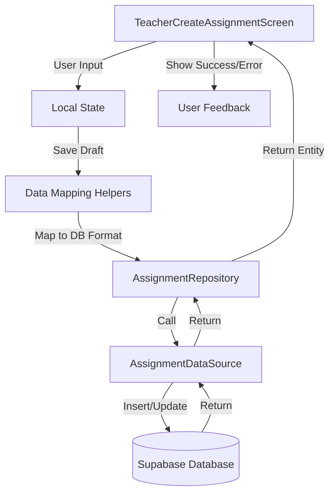

# Kế Hoạch Tích Hợp Supabase cho Chức Năng Tạo Bài Tập

## Tổng Quan

Mục tiêu: Tích hợp Supabase vào `teacher_create_assignment_screen.dart` để lưu trữ bài tập và câu hỏi vào database thay vì chỉ lưu trong local state.

## Phân Tích Hiện Trạng

### Infrastructure Đã Có Sẵn ✅

- **AssignmentRepository** (`lib/domain/repositories/assignment_repository.dart`) - Interface đã định nghĩa đầy đủ
- **AssignmentRepositoryImpl** (`lib/data/repositories/assignment_repository_impl.dart`) - Implementation hoàn chỉnh với error handling
- **AssignmentDataSource** (`lib/data/datasources/assignment_datasource.dart`) - CRUD operations cho assignments, questions, distributions
- **Assignment Entity** (`lib/domain/entities/assignment.dart`) - Freezed entity với JSON serialization
- **Assignment Providers** (`lib/presentation/providers/assignment_providers.dart`) - Riverpod providers
- **AssignmentBuilderNotifier** (`lib/presentation/providers/assignment_builder_notifier.dart`) - State management với autosave pattern
- **Database Schema** (`db/02_create_question_bank_tables.sql`) - Tables: `assignments`, `assignment_questions`, `assignment_distributions`
- **RPC Function** - `publish_assignment` RPC đã có sẵn cho transaction-safe publishing

### Current State của `teacher_create_assignment_screen.dart`

- ❌ Data chỉ lưu trong local state (`_questions` list, `_titleController`, `_descriptionController`)
- ❌ `_handleSaveDraft()` và `_handleSaveAndPublish()` có `// TODO: Implement actual save logic`
- ❌ Chưa có integration với repository
- ❌ Chưa có data mapping từ UI format → Database format
- ❌ Chưa có loading states và error handling cho Supabase operations

## Implementation Plan

### Phase 1: Data Mapping & Helper Functions (Foundation)

#### 1.1 Tạo Data Mapping Helpers

**File:** `lib/presentation/views/assignment/teacher/teacher_create_assignment_screen.dart`

**Tasks:**

- [ ] Implement `_mapAssignmentToDb()` helper method
  - Map UI fields (`_titleController.text`, `_descriptionController.text`, `_dueDate`, `_dueTime`, `_timeLimit`) → Database format
  - Include `teacher_id` từ `auth.currentUser.id`
  - Set `is_published = false` cho draft
  - Calculate `total_points` từ `_questions`
  - Convert `DateTime` → ISO 8601 string cho `due_at`
  - Convert `_timeLimit` string → `int` cho `time_limit_minutes`

- [ ] Implement `_mapQuestionsToAssignmentQuestions()` helper method
  - Map `_questions` list → `assignment_questions` table format
  - Handle both old format (`List<String>`) và new format (`List<Map<String, dynamic>>`)
  - Set `question_id = null` (new questions, not from bank)
  - Build `custom_content` JSON với `type`, `text`, `images`, `options`
  - Set `points` từ `_getPointsForQuestion()`
  - Set `order_idx` (1-based index)

- [ ] Implement `_calculateTotalPoints()` helper method
  - Sum tất cả points từ `_questions` list
  - Return `double`

**Reference:** Section 4.2 trong `docs/prompts/supabase_integration_prompt.md`

#### 1.2 Convert Screen to ConsumerStatefulWidget

**File:** `lib/presentation/views/assignment/teacher/teacher_create_assignment_screen.dart`

**Tasks:**

- [ ] Change `StatefulWidget` → `ConsumerStatefulWidget`
- [ ] Change `State` → `ConsumerState`
- [ ] Import `flutter_riverpod` và `assignment_providers.dart`
- [ ] Add `ref` parameter để access providers

### Phase 2: Save Draft Integration

#### 2.1 Implement `_handleSaveDraft()` Method

**File:** `lib/presentation/views/assignment/teacher/teacher_create_assignment_screen.dart`

**Tasks:**

- [ ] Add `_assignmentId` state variable để track assignment ID sau lần save đầu tiên
- [ ] Add `_isSaving` state variable cho loading state
- [ ] Implement validation:
  - Form validation (`_formKey.currentState!.validate()`)
  - Check `_questions.isNotEmpty`
- [ ] Map data:
  - Call `_mapAssignmentToDb()` để map assignment data
  - Call `_mapQuestionsToAssignmentQuestions()` để map questions data
  - Map distributions data (empty list for now, can be added later)
- [ ] Get repository từ provider: `ref.read(assignmentRepositoryProvider)`
- [ ] Logic flow:
  - If `_assignmentId == null` → Create new assignment:
    - Call `repository.createAssignment(assignmentData)`
    - Store returned `assignment.id` vào `_assignmentId`
    - Then call `repository.saveDraft()` với questions và distributions
  - If `_assignmentId != null` → Update existing:
    - Call `repository.saveDraft()` với `assignmentId`, `assignmentPatch`, `questions`, `distributions`
- [ ] Loading state:
  - Set `_isSaving = true` trước khi call repository
  - Set `_isSaving = false` trong `finally` block
- [ ] Error handling:
  - Wrap trong try-catch
  - Show SnackBar với error message (tiếng Việt từ repository)
  - Log error với AppLogger
- [ ] Success handling:
  - Show success SnackBar
  - Update `_assignmentId` nếu là create mới

**Reference:** Section 7.2 và 9.2 trong `docs/prompts/supabase_integration_prompt.md`

### Phase 3: Publish Assignment Integration

#### 3.1 Implement `_handleSaveAndPublish()` Method

**File:** `lib/presentation/views/assignment/teacher/teacher_create_assignment_screen.dart`

**Tasks:**

- [ ] Similar validation như `_handleSaveDraft()`
- [ ] Add `_isPublishing` state variable
- [ ] Map data (same as save draft)
- [ ] Call `repository.publishAssignment()` với:
  - `assignment` data (với `is_published = true`)
  - `questions` data
  - `distributions` data
- [ ] Loading state với `_isPublishing`
- [ ] Error handling (same pattern)
- [ ] Success handling:
  - Show success SnackBar
  - Navigate back hoặc to assignment detail screen (optional)

**Reference:** Section 7.2 trong `docs/prompts/supabase_integration_prompt.md`

### Phase 4: UI Updates & Loading States

#### 4.1 Add Loading Indicators

**File:** `lib/presentation/views/assignment/teacher/teacher_create_assignment_screen.dart`

**Tasks:**

- [ ] Update `onSaveAndPublish` callback trong `ToolsDrawer`:
  - Show loading dialog khi `_isSaving || _isPublishing`
  - Disable buttons khi đang save/publish
- [ ] Add CircularProgressIndicator trong AppBar hoặc overlay khi saving
- [ ] Update FAB và drawer buttons để disable khi saving

#### 4.2 Update Question Management

**File:** `lib/presentation/views/assignment/teacher/teacher_create_assignment_screen.dart`

**Tasks:**

- [ ] Update `_addQuestionFromScreen()` để handle saved questions với `id`
- [ ] Update `_editQuestion()` để handle questions đã có `id` từ database
- [ ] Update `onDelete` trong question cards để call repository nếu question đã có `id`
- [ ] Sync `_questions` list với database state sau mỗi save operation

### Phase 5: Error Handling & Validation

#### 5.1 Enhanced Error Handling

**File:** `lib/presentation/views/assignment/teacher/teacher_create_assignment_screen.dart`

**Tasks:**

- [ ] Wrap tất cả repository calls trong try-catch
- [ ] Use `ErrorTranslationUtils.translateError()` pattern (đã có trong repository)
- [ ] Show user-friendly error messages trong SnackBar
- [ ] Log errors với AppLogger cho debugging
- [ ] Handle specific error cases:
  - Authentication errors (user not logged in)
  - Network errors
  - Validation errors
  - RLS policy violations

#### 5.2 Data Validation

**File:** `lib/presentation/views/assignment/teacher/teacher_create_assignment_screen.dart`

**Tasks:**

- [ ] Validate `title` không rỗng
- [ ] Validate `_questions.isNotEmpty` trước khi save/publish
- [ ] Validate `due_at` là future date (nếu có)
- [ ] Validate `time_limit_minutes > 0` (nếu có)
- [ ] Validate `total_points >= 0` (nếu có)
- [ ] Validate questions có đủ data (text, options cho MCQ, etc.)

### Phase 6: Testing & Verification

#### 6.1 Create Test Script

**File:** `test/temp_test_save_assignment_draft.dart`

**Tasks:**

- [ ] Create test script theo template trong Section 9.3 của prompt
- [ ] Test `createAssignment()` → verify assignment được tạo trong database
- [ ] Test `saveDraft()` → verify questions và distributions được save
- [ ] Test `publishAssignment()` → verify assignment được publish với `is_published = true`
- [ ] Cleanup test data trong `tearDownAll()`

#### 6.2 End-to-End Testing

**Tasks:**

- [ ] Test create new assignment từ UI
- [ ] Test save draft → verify data persist trong database
- [ ] Test edit assignment → verify update works
- [ ] Test publish assignment → verify `is_published = true` và `published_at` được set
- [ ] Test error cases (network error, validation error, etc.)
- [ ] Test loading states (UI không bị freeze)
- [ ] Test navigation flow sau khi save/publish

#### 6.3 Cleanup

**Tasks:**

- [ ] Delete test file sau khi pass: `test/temp_test_save_assignment_draft.dart`
- [ ] Remove TODO comments
- [ ] Update documentation nếu cần

### Phase 7: Optional Enhancements

#### 7.1 Auto-Save Pattern (Future)

**Tasks:**

- [ ] Consider using `AssignmentBuilderNotifier` với autosave pattern (đã có sẵn)
- [ ] Integrate với `EasyDebounce` để auto-save sau 2 giây không có thay đổi
- [ ] Show subtle "Đang lưu..." indicator

#### 7.2 Load Existing Assignment (Future)

**Tasks:**

- [ ] Add route parameter để load existing assignment
- [ ] Implement `_loadAssignment()` method để fetch từ database
- [ ] Populate UI với existing data
- [ ] Handle edit mode vs create mode

#### 7.3 Image Upload (Future)

**Tasks:**

- [ ] Implement Supabase Storage integration cho question images
- [ ] Upload images trước khi save question
- [ ] Update `custom_content.images` với public URLs

## Data Flow Diagram



## Key Implementation Details

### Data Mapping Example

**UI Format:**

```dart
{
  'title': _titleController.text,
  'description': _descriptionController.text,
  'dueDate': DateTime(2024, 1, 15, 23, 59),
  'timeLimit': '45',
  'questions': [
    {
      'number': 1,
      'type': QuestionType.multipleChoice,
      'text': 'Question text',
      'options': [...],
      'points': 10.0,
    },
  ],
}
```

**Database Format:**

```dart
// assignments table
{
  'teacher_id': 'user-uuid',
  'title': 'Assignment title',
  'description': 'Assignment description',
  'is_published': false,
  'due_at': '2024-01-15T23:59:00Z',
  'time_limit_minutes': 45,
  'total_points': 100.0,
}

// assignment_questions table
[
  {
    'assignment_id': 'assignment-uuid',
    'question_id': null,
    'custom_content': {
      'type': 'multiple_choice',
      'text': 'Question text',
      'options': [...],
    },
    'points': 10.0,
    'order_idx': 1,
  },
]
```

## Files to Modify

1. **`lib/presentation/views/assignment/teacher/teacher_create_assignment_screen.dart`**

   - Convert to ConsumerStatefulWidget
   - Add data mapping helpers
   - Implement save draft logic
   - Implement publish logic
   - Add loading states
   - Add error handling

## Dependencies

- ✅ `assignment_repository_provider` - Đã có sẵn
- ✅ `AssignmentRepository` - Đã có sẵn
- ✅ `AssignmentDataSource` - Đã có sẵn
- ✅ `SupabaseService` - Đã có sẵn
- ✅ `ErrorTranslationUtils` - Đã có sẵn
- ✅ `AppLogger` - Đã có sẵn

## Success Criteria

- [ ] User có thể tạo assignment mới và lưu vào database
- [ ] User có thể save draft và tiếp tục edit sau
- [ ] User có thể publish assignment với `is_published = true`
- [ ] Questions được lưu vào `assignment_questions` table
- [ ] Loading states hoạt động đúng (UI không freeze)
- [ ] Error messages hiển thị rõ ràng (tiếng Việt)
- [ ] Data persist qua app restarts
- [ ] RLS policies được enforce đúng (teacher chỉ thấy assignments của mình)

## Notes

- **Pattern Reference:** Có thể tham khảo `create_class_screen.dart` đã tích hợp Supabase hoàn chỉnh
- **Testing:** Sử dụng test script template từ prompt để verify từng function
- **Error Handling:** Repository đã có error translation, chỉ cần catch và show trong UI
- **State Management:** Có thể consider migrate sang `AssignmentBuilderNotifier` trong tương lai để có autosave pattern