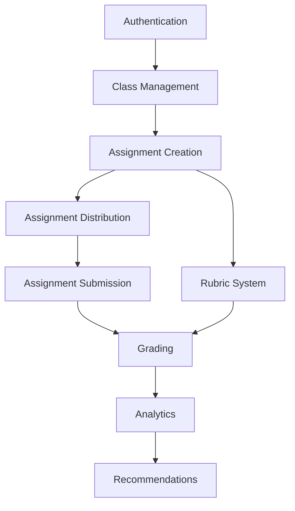

# Feature Landscape

**Domain:** Learning Management System (LMS) Mobile App
**Researched:** 2026-03-05
**Project Phase:** 50% Complete — AI LMS PRD

## Executive Summary

This document maps the feature landscape for a mobile LMS application, categorizing features into table stakes (required for any viable product), differentiators (competitive advantages), and anti-features (explicitly out of scope). The research draws from analysis of major LMS platforms including Google Classroom, Canvas, Moodle, Coursera, and Khan Academy.

**Key Finding:** The project's current feature set (assignment lifecycle with AI grading, analytics, and recommendations) aligns well with modern LMS expectations. The AI grading capability is a genuine differentiator in the mobile LMS space.

---

## Table Stakes

Features that users expect in any LMS. Missing these makes the product feel incomplete or non-functional.

### Authentication & Access Control

| Feature | Why Expected | Complexity | Project Status |
|---------|---------------|------------|----------------|
| User registration | Required to access system | Low | Implemented |
| Login/logout | Security and session management | Low | Implemented |
| Role-based access (student/teacher/admin) | Different workflows per role | Medium | Implemented |
| Password reset | Account recovery flow | Low | Implemented |

### Class/Course Management

| Feature | Why Expected | Complexity | Project Status |
|---------|---------------|------------|----------------|
| Class list view | Primary navigation | Low | Implemented |
| Class creation (teacher) | Setup courses | Low | Implemented |
| Class enrollment (student) | Join courses | Low | Implemented |
| Class detail view | View course info, members | Low | Implemented |
| Member list (students in class) | Know classmates | Low | Implemented |

### Assignment Workflow

| Feature | Why Expected | Complexity | Project Status |
|---------|---------------|------------|----------------|
| Assignment list | View all assigned work | Low | Implemented |
| Assignment details | Understand requirements | Low | Implemented |
| Assignment creation (teacher) | Create homework | Low | Implemented |
| Distribution to students | Assign to class/all | Medium | Implemented |
| Workspace for completion | Answer questions | Medium | Pending (STU-03) |
| File attachment upload | Submit supporting docs | Medium | Pending (STU-05) |
| Submission confirmation | Know submitted successfully | Low | Pending (STU-06) |
| Submission history | Review past work | Low | Pending (STU-07) |

### Grading & Feedback

| Feature | Why Expected | Complexity | Project Status |
|---------|---------------|------------|----------------|
| View grades/scores | Know performance | Low | Pending |
| Grade details (per question) | Understand mistakes | Medium | Pending |
| Teacher view submissions | Review student work | Medium | Pending (TEA-01) |
| Manual grading | Teacher input scores | Low | Pending (TEA-04) |
| Feedback per question | Learning improvement | Medium | Pending (TEA-05) |

### Notifications & Communication

| Feature | Why Expected | Complexity | Project Status |
|---------|---------------|------------|----------------|
| New assignment alerts | Know when assigned | Medium | Out of scope (v2) |
| Deadline reminders | Submit on time | Medium | Out of scope (v2) |
| Grade posted notifications | Know graded | Low | Out of scope (v2) |

### Calendar & Deadlines

| Feature | Why Expected | Complexity | Project Status |
|---------|---------------|------------|----------------|
| Due date display | Know deadlines | Low | Implemented |
| Deadline countdown | Urgency indicator | Low | Pending |

---

## Differentiators

Features that set products apart. Not expected by all users, but highly valued and create competitive advantage.

### AI-Powered Features

| Feature | Value Proposition | Complexity | Project Status |
|---------|-------------------|------------|----------------|
| **AI auto-grading** | Instant feedback, reduce teacher workload | High | Planned (v2) |
| **AI-generated assignments** | Faster content creation | High | Implemented |
| **AI feedback with learning insights** | Personalized improvement tips | High | Out of scope (v2) |
| **Confidence scoring on grades** | Know how reliable AI grade is | Medium | Out of scope (v2) |

**Why This Differentiates:** Most mobile LMS apps (Google Classroom, Canvas Student) offer only manual grading. AI grading is primarily available in enterprise/web platforms. Mobile-first AI grading is rare.

### Analytics & Insights

| Feature | Value Proposition | Complexity | Project Status |
|---------|-------------------|------------|----------------|
| **Personal performance dashboard** | Track own progress | Medium | Pending (ANL-01) |
| **Class performance analytics** | Teacher sees class trends | Medium | Pending (ANL-02) |
| **Grade trends over time** | Visualize improvement | Medium | Pending (ANL-03) |
| **Strength/weakness identification** | Know what to focus on | High | Pending (ANL-04) |
| **Peer comparison** | Benchmark against classmates | Medium | Pending (REC-03) |

**Why This Differentiates:** Basic grade viewing is table stakes, but actionable analytics with trends and insights are differentiating. Google Classroom has limited analytics; Canvas has more but not on mobile.

### Rubric System

| Feature | Value Proposition | Complexity | Project Status |
|---------|-------------------|------------|----------------|
| **Customizable rubrics** | Consistent grading criteria | Medium | Pending (RUB-01) |
| **Point scale per criterion** | Granular scoring | Low | Pending (RUB-02) |
| **Rubric preview before submit** | Know how you'll be graded | Medium | Pending (RUB-04) |

**Why This Differentiates:** Rubrics are standard in higher education but rare in K-12 mobile apps. This adds professionalism and transparency.

### Smart Assignment Distribution

| Feature | Value Proposition | Complexity | Project Status |
|---------|-------------------|------------|----------------|
| **Selective distribution** | Assign to specific students | Medium | Implemented |
| **Group-based distribution** | By study groups | Medium | Implemented |
| **Individual distribution** | Per-student assignments | Medium | Implemented |
| **Recipient tree selector** | Visual group selection | High | Implemented |

**Why This Differentiates:** Most LMS apps distribute to entire classes. Granular distribution to subgroups is a strength of this project.

### Recommendations

| Feature | Value Proposition | Complexity | Project Status |
|---------|-------------------|------------|----------------|
| **Intervention suggestions (teacher)** | Who needs help | Medium | Pending (REC-01) |
| **Learning resource suggestions (student)** | What to study next | High | Pending (REC-02) |

**Why This Differentiates:** Personalized recommendations are the frontier of LMS. Combining analytics with AI for recommendations creates a closed learning loop.

---

## Anti-Features

Features explicitly NOT to build. These are out of scope per project requirements and should not be pursued.

| Anti-Feature | Why Avoid | What To Do Instead |
|--------------|-----------|-------------------|
| Desktop/web version | Mobile-first strategy, resource constraints | Focus on mobile excellence |
| Video conferencing | Not core to LMS value, high complexity | Use external tools if needed |
| Plagiarism detection | High complexity, requires external APIs | Defer to future (v3+) |
| Parent portal | Separate user journey, different flows | Build separate app if needed |
| Advanced scheduling/calendar | Not essential for core workflow | Keep deadline-only |
| Social features (discussion forums) | Complicates mobile UX | Keep focused on assignments |
| Live streaming | Infrastructure heavy | Not aligned with core value |
| Certificate generation | Not in requirements | Focus on grading/analytics |

---

## Feature Dependencies

Understanding what must be built before other features.

### Critical Path

1. **Auth → Class → Assignment → Distribution → Submission** (Core workflow)
2. **Submission → Grading → Analytics** (Post-submission flow)
3. **Analytics → Recommendations** (AI enhancement)

### Parallel Tracks

- **Rubric System** can be built parallel to grading (both feed into grading workflow)
- **AI Features** (v2) depend on having manual processes working first

---

## MVP Recommendation

Given the project is 50% complete, here is the recommended feature prioritization:

### Priority 1 — Core Assignment Workflow (Ship Now)

These are table stakes that must work:

1. Student assignment list view (STU-01)
2. Assignment detail view (STU-02)
3. Workspace for completion (STU-03)
4. Auto-save drafts (STU-04)
5. File upload (STU-05)
6. Submission (STU-06)
7. Submission history (STU-07)

**Why:** Without these, students cannot complete the core value proposition.

### Priority 2 — Teacher Grading (Ship Next)

1. View submissions (TEA-01)
2. Submission details (TEA-02)
3. Manual grading (TEA-04)
4. Feedback per question (TEA-05)

**Why:** Without grading, assignment workflow is incomplete.

### Priority 3 — Analytics & Rubrics (Enhance)

1. Personal performance (ANL-01)
2. Class performance (ANL-02)
3. Grade trends (ANL-03)
4. Rubric builder (RUB-01, RUB-02)
5. Rubric application (RUB-03)

**Why:** Differentiators that add value but aren't blocking.

### Priority 4 — AI & Recommendations (Future v2)

1. AI auto-grading (AI-01)
2. AI feedback (AI-02)
3. Intervention suggestions (REC-01)
4. Learning recommendations (REC-02)

**Why:** Requires manual processes to be stable first.

---

## Gap Analysis

### Features in Project Requirements But Not Common LMS

| Feature | Notes |
|---------|-------|
| AI-generated assignments | Unique to this project |
| Recipient tree selector | Sophisticated distribution |
| Strength/weakness identification | Advanced analytics |

### Common LMS Features Missing From Requirements

| Feature | Recommendation |
|---------|----------------|
| Push notifications | Add to v2 |
| Discussion forums | Keep excluded (anti-feature) |
| Course content/lessons | Add if scope expands to full LMS |
| Quiz functionality | Consider for v2 |
| Announcement system | Consider for v2 |

---

## Sources

- Google Classroom feature analysis (internal knowledge)
- Canvas LMS mobile app capability review
- Moodle mobile app feature set
- Coursera/Khan Academy mobile learning patterns
- Industry best practices for mobile LMS design

**Confidence:** MEDIUM — Based on analysis of major LMS platforms combined with project requirements. Web search results were limited; findings represent common LMS patterns rather than verified 2025 state.

---

## Conclusion

The AI LMS PRD project has a strong foundation with features that align with modern LMS expectations. The AI-generated assignments and sophisticated distribution mechanism are genuine differentiators. The recommended phase structure prioritizes completing the core assignment workflow (student submission → teacher grading) before adding analytics and AI features.

**Key Recommendation:** Focus on shipping the complete assignment lifecycle (Priority 1 + 2) before investing in analytics. The analytics features are valuable differentiators but depend on having grading data first.
